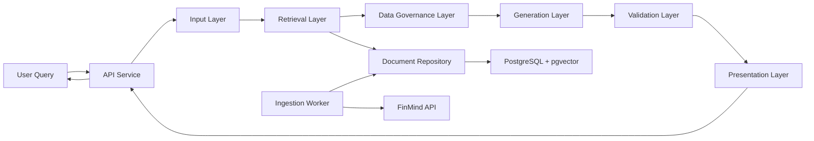

# System Architecture

## High-Level Flow

## Service Boundaries

### API Service

- Receives query requests.
- Orchestrates the six-layer pipeline.
- Returns grounded answers and source lookup.

### Ingestion Worker

- Pulls public data from FinMind.
- Normalizes source metadata.
- Writes raw documents and embeddings into PostgreSQL.

### Retrieval Service

- Runs metadata filtering and semantic retrieval.
- Can later be split into a standalone service if traffic grows.

### Validation Service

- Computes trust score and answer gate decisions.
- Keeps business rules isolated from the generation layer.

## Code-to-Architecture Mapping

| Layer | Primary File | Responsibility |
| --- | --- | --- |
| Input | `src/llm_stock_system/layers/input_layer.py` | Intent parsing and query structuring |
| Retrieval | `src/llm_stock_system/layers/retrieval_layer.py` | Candidate document recall |
| Data Governance | `src/llm_stock_system/layers/data_governance_layer.py` | Cleaning, dedupe, freshness, trust |
| Generation | `src/llm_stock_system/layers/generation_layer.py` | Controlled synthesis |
| Validation | `src/llm_stock_system/layers/validation_layer.py` | Confidence scoring and gate |
| Presentation | `src/llm_stock_system/layers/presentation_layer.py` | UI-facing response format |

## Deployment Notes

- Start with a modular monolith to keep development velocity high.
- Keep adapters and repositories behind interfaces so each layer can be extracted into separate services later.
- Use PostgreSQL for transactional and audit data, and pgvector for semantic recall.
