# Responsibility Distribution

## Scope

This diagram set is based on the current implementation and refactor docs:

- `src/llm_stock_system/layers/input_layer.py`
- `src/llm_stock_system/core/models.py`
- `src/llm_stock_system/services/query_data_hydrator.py`
- `src/llm_stock_system/adapters/llm.py`
- `src/llm_stock_system/adapters/openai_responses.py`
- `src/llm_stock_system/layers/validation_layer.py`
- `docs/phase2-hydrator-refactoring.md`
- `docs/phase3-validation-layer-enhancement.md`
- `docs/phase4-generation-layer-refactoring.md`

## Current Responsibility Map

```mermaid
flowchart LR
    User["User Query"] --> Pipeline["QueryPipeline<br/>process orchestration"]

    Pipeline --> Input["InputLayer<br/>entity resolution<br/>topic detection<br/>question_type detection<br/>intent inference<br/>topic-tag extraction<br/>time-range detection<br/>stance detection"]
    Input --> Query["StructuredQuery / core.models<br/>question_type -> intent<br/>intent -> required/preferred facets<br/>fallback topic tags<br/>query contract"]

    Query --> Hydrator["QueryDataHydrator<br/>facet sync map<br/>time-window calculation<br/>data hydration<br/>follow-up scheduling"]
    Query --> Retrieval["RetrievalLayer<br/>document recall"]
    Retrieval --> Governance["DataGovernanceLayer<br/>cleanup / dedupe / freshness / trust"]

    Governance --> Generation["GenerationLayer<br/>thin shell<br/>load prompt + call client"]

    Generation --> RuleBased["RuleBasedSynthesisClient<br/>intent dispatch<br/>summary / impacts / risks<br/>evidence regex extraction<br/>partial domain guardrails"]
    Generation --> OpenAI["OpenAIResponsesSynthesisClient<br/>prompt assembly<br/>Responses API call<br/>preliminary answer<br/>JSON parsing<br/>fallback / guardrails"]

    RuleBased --> Answer["AnswerDraft"]
    OpenAI --> Answer

    Answer --> Validation["ValidationLayer<br/>base confidence<br/>required facet cap<br/>preferred facet penalty<br/>question-type checks"]
    Validation --> Presentation["PresentationLayer<br/>response formatting"]

    classDef heavy fill:#f9d6d5,stroke:#b94a48,color:#222;
    classDef medium fill:#fdecc8,stroke:#b78103,color:#222;
    classDef light fill:#d8eef7,stroke:#2f6f89,color:#222;

    class Input,RuleBased,OpenAI,Validation heavy;
    class Query,Hydrator medium;
    class Pipeline,Retrieval,Governance,Generation,Presentation,Answer light;
```

### Reading The Current State

- `InputLayer` owns too many semantic decisions, from entity parsing to routing signals.
- `StructuredQuery` is already becoming the shared contract, but it still carries `question_type` compatibility concerns.
- `GenerationLayer` is intentionally thin, so most generation responsibility has shifted into the two adapters.
- `ValidationLayer` mixes base scoring, facet scoring, and many query-specific content checks.

## Target Responsibility Map

```mermaid
flowchart LR
    User["User Query"] --> Pipeline["QueryPipeline<br/>orchestration only"]

    Pipeline --> Input["InputLayer<br/>normalize request only"]

    Input --> Resolver["Query Semantics Resolver<br/>EntityResolver<br/>IntentResolver<br/>TopicTagResolver<br/>TimeRangeResolver<br/>StanceResolver"]
    Resolver --> Query["StructuredQuery<br/>single query contract"]

    Query --> Policy["Intent / Facet Policy Registry<br/>intent -> facet spec<br/>intent -> generation profile<br/>intent -> validation profile<br/>question_type kept only as legacy mapping"]

    Query --> Hydrator["QueryDataHydrator<br/>facet sync execution only"]
    Policy --> Hydrator

    Query --> Retrieval["RetrievalLayer"]
    Retrieval --> Governance["DataGovernanceLayer"]

    Governance --> Generation["GenerationLayer<br/>generation orchestration"]
    Policy --> Generation

    Generation --> Brief["Generation Brief Builder<br/>convert intent / tags / evidence<br/>into one generation brief"]
    Brief --> RuleRenderer["Rule Renderer<br/>rule-based fallback"]
    Brief --> LLMRenderer["LLM Renderer<br/>prompt + API call"]
    RuleRenderer --> Guardrails["Post-generation Guardrails<br/>target price<br/>fundamental valuation<br/>format correction"]
    LLMRenderer --> Guardrails
    Guardrails --> Answer["AnswerDraft"]

    Answer --> Validation["ValidationLayer"]
    Policy --> Validation
    Validation --> Score["Confidence Scorer<br/>base score + facet score"]
    Validation --> Checks["Content Checks<br/>small set of intent-specific checks"]
    Score --> Presentation["PresentationLayer"]
    Checks --> Presentation

    classDef target fill:#dff3e3,stroke:#2f7d4a,color:#222;
    classDef stable fill:#d8eef7,stroke:#2f6f89,color:#222;
    classDef policy fill:#efe2ff,stroke:#7d4bc2,color:#222;

    class Pipeline,Input,Query,Hydrator,Retrieval,Governance,Generation,Brief,RuleRenderer,LLMRenderer,Guardrails,Validation,Score,Checks,Presentation target;
    class Resolver stable;
    class Policy policy;
```

### Key Shifts

- Semantic decisions move out of `InputLayer` into focused resolver components.
- Shared routing logic is centralized in a `Policy Registry` instead of being split across input, models, adapters, and validation.
- `GenerationLayer` becomes the real orchestrator, while renderers and guardrails take narrower roles.
- `ValidationLayer` keeps ownership of validation, but splits into score calculation and content checks.

## Summary Table

| Area | Current | Target |
| --- | --- | --- |
| Query parsing | `InputLayer` owns many rules | Resolver set + `StructuredQuery` contract |
| Routing policy | Split across input / models / adapters / validation | Central policy registry |
| Generation | `GenerationLayer` thin, adapters heavy | `GenerationLayer` orchestrates, renderers specialized |
| Validation | Score and special cases mixed together | Score engine + content checks |
| Legacy compatibility | `question_type` still visible in many places | Kept only at the compatibility edge |
